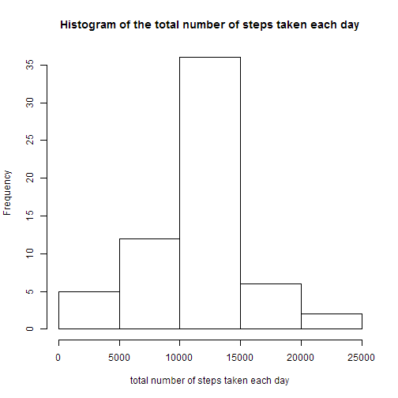

Analysis of steps taken each day
========================================================

##Step 1: Loading and preprocessing the data

We begin the analysis by load the data in R.


```r
steps_data <- read.csv("./data/activity.csv")
steps_data["date"] <- as.Date(steps_data$date, "%Y-%m-%d")
```

Process/transform the data (if necessary) into a format suitable for your analysis


```r
steps.bydate <- aggregate(steps.bydate$steps, by = list(steps.bydate$date), FUN = sum, na.rm = TRUE)
names(steps.bydate)[1] <- "date"
names(steps.bydate)[2] <- "steps"


steps.byinterval.avg <- aggregate(steps_data$steps, by = list(steps_data$interval), FUN = mean, na.rm = TRUE)
names(steps.byinterval.avg)[1] <- "interval"
names(steps.byinterval.avg)[2] <- "steps"
```

## Step 2: What is mean total number of steps taken per day?

### 1. Make a histogram of the total number of steps taken each day

```r
hist(steps.bydate$steps, main = "Histogram of the total number of steps taken each day", xlab = "total number of steps taken each day")
```

 


### 2. Calculate and report the mean and median total number of steps taken per day

```r
mean(steps.bydate$steps, na.rm = T)
```

```
## [1] 9354
```

```r
median(steps.bydate$steps, na.rm = T)
```

```
## [1] 10395
```


* The total mean of the total number of steps taken each day is 9354.2295. 
* The total median of the total number of steps taken each day is 1.0395 &times; 10<sup>4</sup>.

##Step 3: What is the average daily activity pattern?

### 1. Make a time series plot (i.e. type = "l") of the 5-minute interval (x-axis) and the average number of steps taken, averaged across all days (y-axis)


```r
with(steps.byinterval.avg, plot(interval, steps, type = "l", 
                                xlab = "5-minute Time interval ", 
                                ylab = "Mean number of steps taken (all days)"))
title(main = "Time series plot for average number of steps taken at 5 minute interval")
```

 

### 2. Which 5-minute interval, on average across all the days in the dataset, contains the maximum number of steps?


```r
steps.byinterval.avg[steps.byinterval.avg$steps == max(steps.byinterval.avg$steps), 1]
```

```
## [1] 835
```

## Imputing missing values

### 1. Calculate and report the total number of missing values in the dataset (i.e. the total number of rows with NAs)


```r
sum(is.na(steps_data))
```

```
## [1] 2304
```

### 2. Devise a strategy for filling in all of the missing values in the dataset. The strategy does not need to be sophisticated. For example, you could use the mean/median for that day, or the mean for that 5-minute interval, etc.


```r
interval.tostep <- function(interval){
  steps.byinterval.avg[steps.byinterval.avg$interval == interval, 2]
}
```

### 3. Create a new dataset that is equal to the original dataset but with the missing data filled in.


```r
steps_data_noNA <- steps_data
count = 0
for(i in 1:nrow(steps_data_noNA)){
        if(is.na(steps_data_noNA[i, 1])){
                steps_data_noNA[i, 1] = interval.tostep(steps_data_noNA[i, 3])
                count = count + 1
        }
}
```


### 4. Make a histogram of the total number of steps taken each day and Calculate and report the mean and median total number of steps taken per day. Do these values differ from the estimates from the first part of the assignment? What is the impact of imputing missing data on the estimates of the total daily number of steps?


```r
steps_data_noNA_avg <- aggregate(steps_data_noNA$steps, by = list(steps_data_noNA$date), FUN = sum)
names(steps_data_noNA_avg)[1] = "date"
names(steps_data_noNA_avg)[2] = "steps"        
hist(steps_data_noNA_avg$steps, main = "Histogram of the total number of steps taken each day", xlab = "total number of steps taken each day")
```

 


```r
mean(steps_data_noNA_avg$steps)
```

```
## [1] 10766
```


```r
median(steps_data_noNA_avg$steps)
```

```
## [1] 10766
```


After filling the missing values following are the calculated mean and medain values: 

* The total mean of the total number of steps taken each day is 1.0766 &times; 10<sup>4</sup>. 
* The total median of the total number of steps taken each day is 1.0766 &times; 10<sup>4</sup>.

We see an increase in mean (1.0766 &times; 10<sup>4</sup>) and median (1.0766 &times; 10<sup>4</sup>) total daily number of steps when we compare it with previous mean and median with missing values in the dataset.
